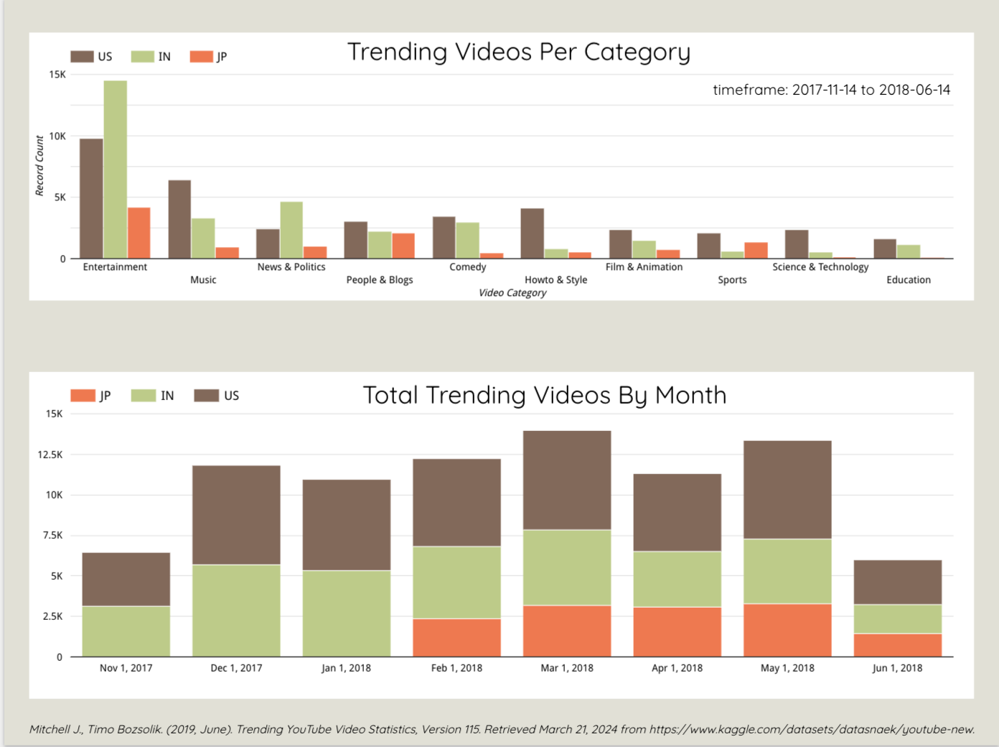
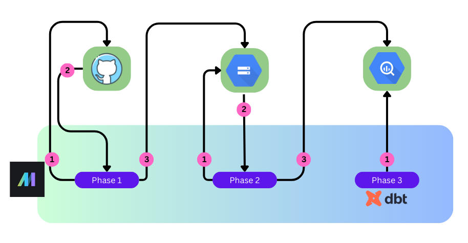
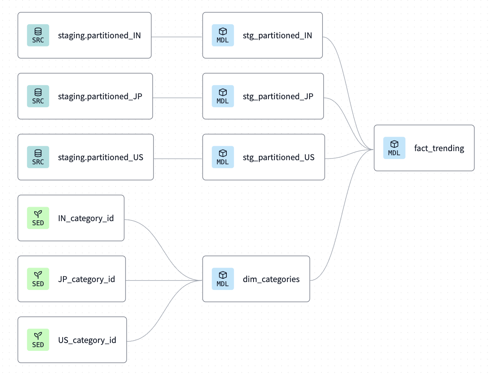
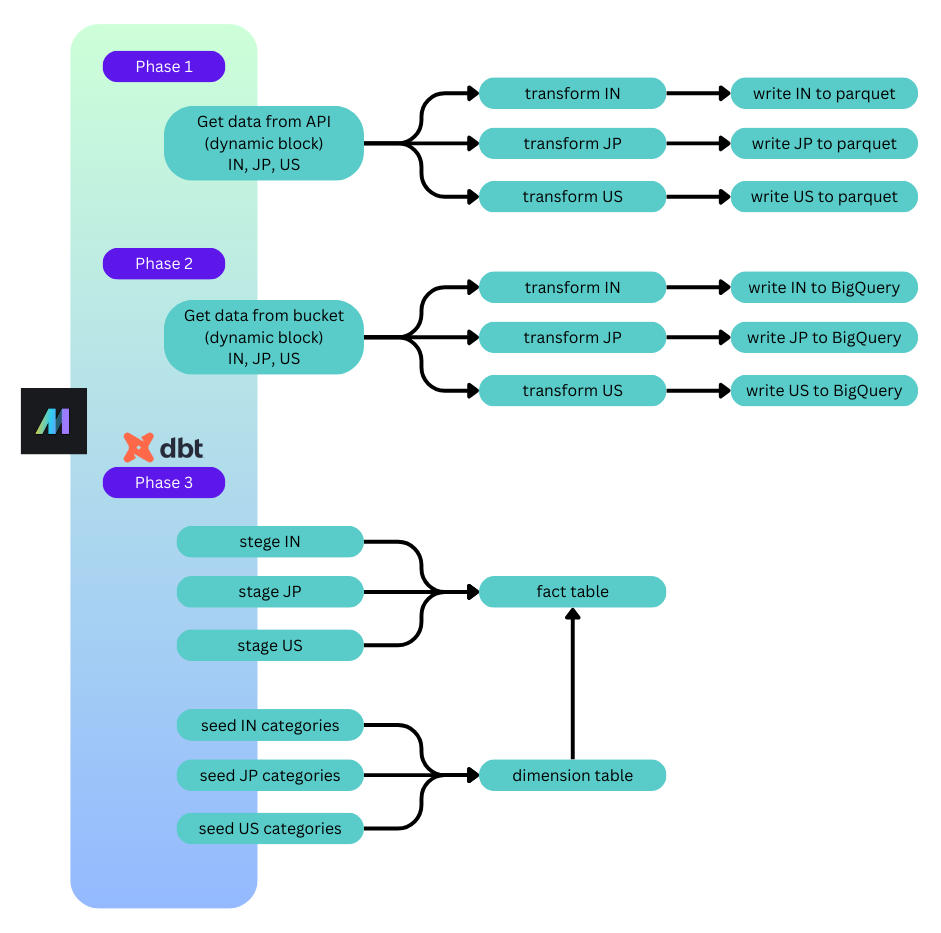

# YouTube Trending Video Analysis

<!-- TOC -->
* [YouTube Trending Video Analysis](#youtube-trending-video-analysis)
  * [Problem Statement](#problem-statement)
  * [Dashboard](#dashboard)
  * [Data Source](#data-source-)
  * [Project Breakdown](#project-breakdown)
    * [Data Lake Details](#data-lake-details)
    * [Data Warehouse Details](#data-warehouse-details)
    * [Data Transformation Details](#data-transformation-details)
    * [Orchestrator](#orchestrator)
  * [Prerequisites](#prerequisites)
    * [GCS Project Creation](#gcs-project-creation)
    * [GCS Service Account Creation](#gcs-service-account-creation)
* [Getting Started](#getting-started)
  * [All the steps at once](#all-the-steps-at-once)
    * [For Mac / Linux](#for-mac--linux)
    * [For Windows](#for-windows)
  * [More Detailed Steps](#more-detailed-steps)
    * [Clone this repo](#clone-this-repo)
    * [Install Python requirements](#install-python-requirements)
    * [Environment file](#environment-file)
    * [Terraform GCS bucket creation](#terraform-gcs-bucket-creation)
    * [Mage](#mage)
      * [For Mac / Linux](#for-mac--linux-1)
      * [For Windows](#for-windows-1)
      * [Data download / transform / upload with Mage](#data-download--transform--upload-with-mage)
* [Results](#results)
* [Cleanup](#cleanup)
<!-- TOC -->

## Problem Statement

YouTube tracks statistics for all videos on the platform and using proprietary methodology, determines which videos are trending. 
The list is unique for each country YouTube serves, meaning that users in the US are seeing a different trending list 
than users in India or Japan. Given this information, can any similarities be found in the trending video data for India, Japan, 
and the United States? 

## Dashboard

The dashboard was created in Looker Studio and is available [here](https://lookerstudio.google.com/reporting/e3e017c5-a048-435b-a77f-dc090efbfa57).




## Data Source 

The data is from the "Trending YouTube Video Statistics" dataset on [Kaggle](https://www.kaggle.com/datasets/datasnaek/youtube-new).
There are many countries to choose from, but we will only use data from India, Japan, and the United States.
The data is being hosted in GitHub because the Japanese file had encoding errors that needed to be corrected. 

There are 6 files in the project. Three files for trending video data:
* INvideos.csv.zip
* JPvideos.csv.zip
* USvideos.csv.zip

And three files that serve as a map for the `category_id` field. These are used in the dbt step as seeds:
* IN_category_id.csv
* JP_category_id.csv
* US_category_id.csv
  

## Project Breakdown

The project is a series of pipelines orchestrated by [Mage](https://www.mage.ai/). There are five distinct parts to the project:
* **Setup**: create GCS project, save credentials locally, run setup script to create GCS bucket and BigQuery schema
* **Phase 1**: (mage) import data from API, transform for data lake, save to GCS bucket 
* **Phase 2**: (mage) import data from GCS, transform for data warehouse, save to BigQuery
* **Phase 3**: (mage) create BigQuery views via dbt, prepare for dashboard
* **Dashboard**: create dashboard in Looker Studio 



### Data Lake Details
I am using Google Cloud Storage for my data lake. Data will be stored in the following parquet files:
* rankings_IN.parquet
* rankings_JP.parquet
* rankings_US.parquet


### Data Warehouse Details
I am using BigQuery for my data warehouse. Data is stored in three tables: 
* partitioned_IN
* partitioned_JP
* partitioned_US

Each table is partitioned by `trending_date`. The data is not clustered since clustering (and partitioning for that matter)
are not effective for data less than 1GB. These datasets are 48MB, 18MB, and 58MB, respectively.

### Data Transformation Details
Data is transformed with dbt. The individual tables for IN, JP, and US are given a new `category_name` field by combinig the `category_id` data with the seed file data which is a mapping of id to category name. All video data is then combined into one fact table for use in Looker Studio.

<details>
    <summary>DAG image</summary>


</details>

### Orchestrator

The Mage orchestrator runs the three phases mentioned above:
* **Phase 1**: import data from API, transform for data lake, save to GCS bucket 
* **Phase 2**: import data from GCS, transform for data warehouse, save to BigQuery
* **Phase 3**: transform BigQuery data using dbt, prepare for dashboard

<details>
    <summary>Mage Pipelines</summary>


</details>

## Prerequisites

The following need to be installed before you can run this project:
1. Python 3 
2. Terraform
3. Docker

### GCS Project Creation

Create a new project called `youtube-video-ranks` via: https://console.cloud.google.com/projectcreate

### GCS Service Account Creation

https://console.cloud.google.com/iam-admin/serviceaccounts
Create a service account in your Google Cloud project 
IAM & Admin -> Service Accounts -> Create a Service Account 
<p>With Roles:

* Cloud Storage -> Storage Admin
* BigQuery -> BigQuery Admin
* Compute Engine -> Compute Admin 


Note: this is meant to be a demo and the permissions granted above are overly broad. 

Service Account -> Actions -> Manage Keys -> Create a New Key -> JSON
    Save this json file to `~/keys/service_account_key.json`


# Getting Started

## All the steps at once
The steps are explained more below but if you just want to hit the ground running, here are all the steps at once.
This assumes you have done all the prerequisite steps. 

### For Mac / Linux
```commandline
git clone https://github.com/ANKershaw/youtube_video_ranks.git
cd youtube_video_ranks.git
pip install -r requirements.txt
python3 environment_setup.py
cd terraform
terraform init
terraform plan
terraform apply
cd ../mage
chmod +x mage_start.sh
./mage_start.sh
python3 mage_pipelines_automatic.py
```

### For Windows
```commandline
git clone https://github.com/ANKershaw/youtube_video_ranks.git
cd youtube_video_ranks.git
pip install -r requirements.txt
python3 environment_setup.py
cd terraform
terraform init
terraform plan
terraform apply
cd ../mage
./mage_start.bat
python3 mage_pipelines_automatic.py
```

## More Detailed Steps

### Clone this repo

``` commandline
git clone https://github.com/ANKershaw/youtube_video_ranks.git
```

### Install Python requirements

```commandline
pip install -r requirements.txt
```

### Environment file

Create project variable files by running:

```commandline
python3 environment_setup.py
```
This script will ask for:
1. Google Cloud project name (eg: 'youtube-video-ranks-1234'). If you don't remember your project name, it is in the service_account_key.json file you created.
2. The name of the bucket you want created (must be GLOBALLY unique; try adding '-bucket' after your project name)
3. [Geographical location](https://cloud.google.com/storage/docs/locations#available-locations) for the bucket (default: US)
4. [Region](https://cloud.google.com/storage/docs/locations) for the bucket (default: us-west1)
5. Location of your Google service account key (should be `~/keys/service_account_key.json`)

The script will create the following files:
* terraform/terraform.tfvars
* mage/.env
* mage/mage_start.bat
* mage/mage_start.sh


### Terraform GCS bucket creation

Run the following from the terraform directory (youtube_video_ranks/terraform):
```commandline
cd terraform
terraform init
terraform plan
terraform apply
```

    
### Mage

<p>There is a pre-configured mage start script in the mage_start.sh and mage_start.bin files to help you get mage started

#### For Mac / Linux
From 'youtube_video_ranks/mage' run:
```commandline
chmod +x mage_start.sh
./mage_start.sh
```

#### For Windows
From 'youtube_video_ranks/mage' run:
```commandline
./mage_start.bat
```

After mage starts, you can check out the pipelines via:
[the Mage console](http://localhost:6789/pipelines/youtube_video_ranks/edit?sideview=tree)

Note: at startup, Mage may attempt to execute the pipelines on its own. They should fail with an error. You can proceed
to the next step. 

#### Data download / transform / upload with Mage

There are 3 mage pipelines, and each one can be independently run in case of error.

Phase 1 : Move data from API to GCS
Phase 2 : Move data from GCS to BigQuery
Phase 3 : Create views with dbt 

The pipelines can be executed automatically by running:
```commandline
python3 mage_pipelines_automatic.py
```

If you want a more interactive experience, try:
```commandline
python3 mage_pipelines_interactive.py
```
And follow the prompts to run the pipelines. 

You can check out the running pipelines by visiting the [Pipeline runs](http://localhost:6789/pipeline-runs) page

# Results
After completing all steps above, you will have the following files:
Google Cloud Storage
* rankings_IN.parquet - API data from INvideos.csv.zip created in Mage pipeline Phase 1
* rankings_JP.parquet - API data from JPvideos.csv.zip created in Mage pipeline Phase 1
* rankings_US.parquet - API data from USvideos.csv.zip created in Mage pipeline Phase 1

BigQuery
<p>Schema: country_data

* partitioned_IN - partitioned table created in Mage pipeline Phase 2
* partitioned_JP - partitioned table created in Mage pipeline Phase 2
* partitioned_US - partitioned table created in Mage pipeline Phase 2
* IN_category_id - seed table created by dbt in Mage pipeline Phase 3
* JP_category_id - seed table created by dbt in Mage pipeline Phase 3
* US_category_id - seed table created by dbt in Mage pipeline Phase 3
* stg_partitioned_IN - stage table created by dbt in Mage pipeline Phase 3
* stg_partitioned_JP - stage table created by dbt in Mage pipeline Phase 3
* stg_partitioned_US - stage table created by dbt in Mage pipeline Phase 3
* dim_categories - dimension table for categories created by dbt in Mage pipeline Phase 3
* fact_trending - fact table of video data created by dbt in Mage pipeline Phase 3


# Cleanup

From terraform directory:
```commandline
terraform destroy
```
